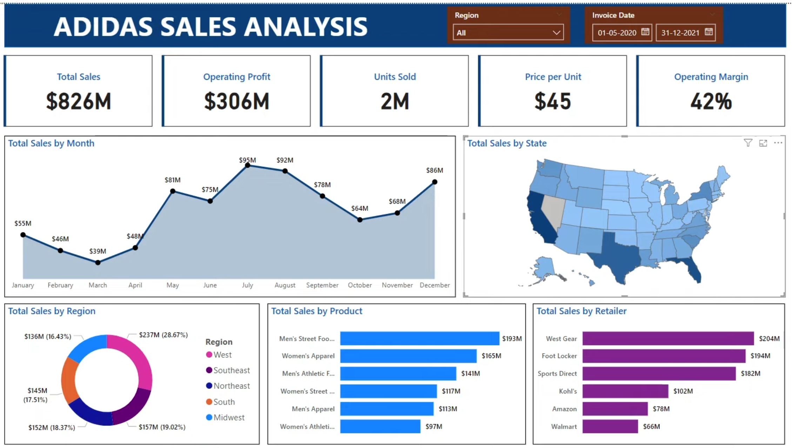

# 📊 Adidas Sales Analysis Dashboard (Power BI)

## 🔎 Project Overview
**This project presents a detailed Adidas Sales Analysis Report built using Power BI.**  
The dashboard provides interactive insights into sales performance across multiple dimensions such as 
**monthly sales, regions, states, product performance, and retailer contributions**.  
It is designed to help stakeholders quickly identify trends, growth opportunities, and strategic priorities.

## 📂 Dataset
**Source:** Adidas Sales Dataset (for analysis purposes)  

## 📂 Dataset Fields
- **Retailer** – Name of retailer  
- **Retailer ID** – Unique identifier of retailer  
- **Invoice Date** – Date of the sale  
- **Region, State, City** – Location details  
- **Product** – Product sold  
- **Price per Unit** – Sale price per unit  
- **Units Sold** – Number of units sold  
- **Total Sales** – Total revenue generated  
- **Operating Profit** – Profit earned from sales  
- **Operating Margin** – Profit margin percentage  
- **Sales Method** – Online / Retail  

## 📝 Process Overview
1. **Data Preparation:** Imported the Adidas sales dataset (Excel/CSV) and cleaned missing or inconsistent values.  
2. **Data Modeling:** Created relationships between tables (e.g., Products, Regions, Retailers, Sales).  
3. **DAX Calculations:** Developed key metrics such as Total Sales, Operating Profit, Units Sold, and Operating Margin.  
4. **Visualizations:** Built interactive charts including bar charts, line charts, maps, and KPIs to highlight trends and insights.  
5. **Dashboard Design:** Assembled a user-friendly, interactive dashboard for easy exploration of regional, product, and retailer performance.  
6. **Insights Extraction:** Analyzed monthly, regional, product, and retailer trends to provide actionable recommendations.

## 📈 Key Insights
**Detailed Monthly Sales:**
- **January:** $55M  
- **February:** $46M  
- **March:** $39M  
- **April:** $48M  
- **May:** $81M  
- **June:** $75M  
- **July:** $95M (Peak Sales)  
- **August:** $92M  
- **September:** $78M  
- **October:** $64M  
- **November:** $68M  
- **December:** $86M  

**Regional Breakdown:**
- **West:** $237M (28.67%)  
- **Midwest:** $152M (18.37%)  
- **South:** $145M (17.51%)  
- **Southeast:** $157M (19.02%)  
- **Northeast:** $136M (16.43%)  

**Product Performance:**
- **Men’s Street Footwear:** $193M  
- **Women’s Apparel:** $165M  
- **Men’s Athletic Footwear:** $141M  
- **Women’s Street Footwear:** $117M  
- **Men’s Apparel:** $113M  
- **Women’s Athletic Footwear:** $97M  

**Retailer Contributions:**
- **West Gear:** $204M  
- **Foot Locker:** $194M  
- **Sports Direct:** $182M  
- **Kohl’s:** $102M  
- **Amazon:** $78M  
- **Walmart:** $66M  

**Key Metrics:**
- **Total Sales:** $826M  
- **Operating Profit:** $306M  
- **Units Sold:** 2M  
- **Price per Unit:** $45  
- **Operating Margin:** 42%  

## 🛠 Tools & Technologies
- **Power BI:** Data modeling, DAX, interactive dashboards  
- **Excel/CSV:** Dataset preparation and cleaning  
- **Visualization Techniques:** Bar charts, line charts, maps, KPIs, tables

## 📸 Dashboard Preview

## 🚀 Outcomes
- Built an **end-to-end sales performance dashboard**  
- Enabled **data-driven decision-making** by providing insights into regional and product-level sales trends  
- Highlighted **strategic growth opportunities and key retailer contributions**  
- Showcased **profitability and operational efficiency** through KPIs and metrics  

